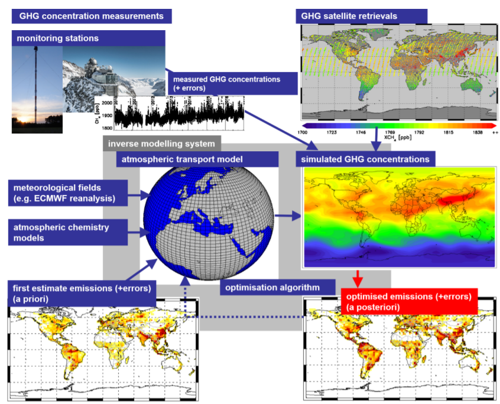
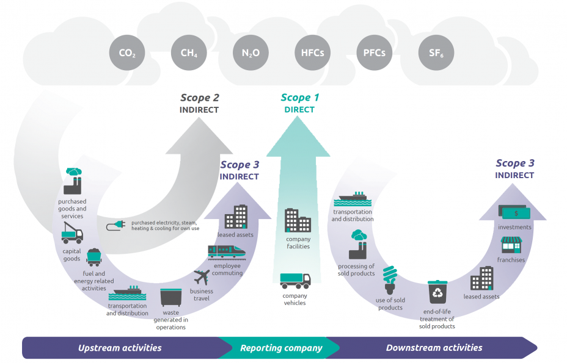
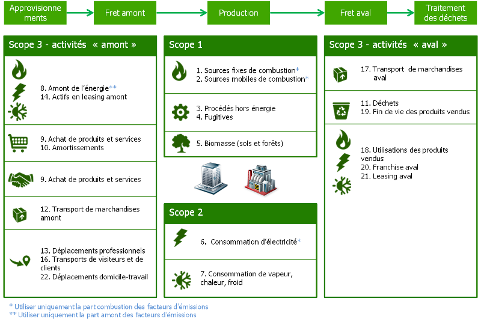

```{r warning=FALSE, message=FALSE, echo = TRUE}
library(dplyr)
library(tidyverse)
library(knitr)
library(plotly)
library(kableExtra)
library(leaflet)
library(RColorBrewer)

```

# Introduction

Greenhouse gases (GHGs) emissions from human activities are considered as the most significant driver of observed climate change since the mid-20th century (IPCC, 2013). In order to better mitigate climate change impacts, policy makers need relevant and accurate data on GHG emissions at various scales. 

Different protocols and methodologies for quantifying GHGs emissions have been developed aiming at allowing organizations (states, municipalities, companies, etc.) to assess their carbon footprins These standards help in identifying concerned gases, sectors' categorization as well as  methodologies to be used to measure the emissions associated with organizations' activities. Self reported inventories are collected, compiled and sorted by multiple organisms of experts in climate change and  carbon analytics. In order to esnsure transparency and public knowledge on emission levels, this data is published through various open data platforms. However, GHG emissions data are published in different formats, levels of transformations, aggregates, frequencies, scales, languages... This makes their use complex and requires mapping and comparison of  different sources in order to build a complete corpus that meets users' needs.

The objective of this report is to propose a compilation of data related to GHG emissions in order to harmonize them in a single accessible database.

In the [next section](#section_2) we address main knowledge and concepts related to greenhouse gas emissions in order to better understand the content of emissions data.

In [section 3](#section_3) we present a catalog of the different data sources that we have been able to identify with a description of the collection and measurement methods used and data providers. We propose at the end of the section a target data model to which we try to map raw GHG emissions data.

In sections [4](#section_4), [5](#section_5) and [6](#section_6), we present the results of exploration of raw data collected from previously identified sources at different geographical scales (world, countries, cities) respectively. GHG emission data is mapped with the proposed data model in section 3 in order to facilitate data sources comparison and assess the accuracy of our model. We will focus in this report on France use case for national and sub-national scale. 


# Domain knowledge {#section_2}

## Grennhouse Gases (GHG)

### Definition


Greenhouse gases constitute a group of gases that absorb infrared radiation from the Earth's surface and trap heat in the atmosphere contributing hence to global warming and climate change. Without greenhouse gases, the average temperature of Earth’s surface would be about -18° rather than the present average of 15°. Atmospheric concentrations are determined by the balance between sources (emissions of the gas from human activities and natural systems) and sinks (the removal of the gas from the atmosphere by conversion to a different chemical compound or absorption by bodies of water).

The main gereenhouse gases are:

- **Water vapour (H2O):** 

Water vapor is the largest contributor to the natural greenhouse effect. Water vapor is fundamentally different from other greenhouse gases in that it can condense and rain out when it reaches high concentrations, and the total amount of water vapor in the atmosphere is in part a function of the Earth’s temperature. While some human activities such as evaporation from irrigated crops or power plant cooling release water vapor into the air, these activities have been determined to have a negligible effect on global climate (IPCC
2013).

- **Carbon dioxide (CO2):**

The IPCC definitively states that *“the increase of CO2 … is caused by anthropogenic emissions from the use of fossil fuel as a source of energy and from land use and land use changes, in particular agriculture”* (IPCC, 2013). The predominant source of anthropogenic CO2 emissions is the combustion of fossil fuels. Forest clearing, other biomass burning, and some non-energy production processes (e.g., cement production) also emit considerable quantities of CO2.

- **Methane (CH4):**

Methane is emitted during the production and transport of coal, natural gas, and oil. Methane emissions also result from livestock and other agricultural practices. The IPCC has estimated that slightly more than half of the current CH4 flux to the atmosphere is anthropogenic, from human activities such as agriculture, fossil fuel production and use, and waste disposal *(IPCC, 2007)*.
  
- **Nitrous oxide (N2O):**

Nitrous oxide is emitted during agricultural and industrial activities, combustion of fossil fuels and solid waste, as well as during treatment of wastewater.

- **Ozone (O3):**

Ozone is present in both the upper stratosphere, where it shields the Earth from harmful levels of ultraviolet radiation, and at lower concentrations in the troposphere, where it is the main component of anthropogenic photochemical “smog.”

- **Fluorinated gases:**

Halocarbons, Sulfur Hexafluoride, and Nitrogen Trifluoride are synthetic, powerful greenhouse gases that are emitted from a variety of industrial processes. These gases are typically emitted in small quantities, but because they are potent greenhouse gases, they are sometimes referred to as high Global Warming Potential gase.
  
### Sources

Anthropogenic GHG refer to emissions caused by human activity. Water vapour (H2O) and ozone (O3) are not included in the scope of GHG accounting since their emission is not directly influenced by human activity. 
The vast majority of anthropogenic GHG emission come from combustion of fossil fuels, principally coal, oil and natural gas, with additional contributions coming from deforestation and other changes in land use. Carbon dioxide (CO2) is considered as the anthropogenic GHG with strongest impact on the climate.

### Global Warming Potential

GHGs warm the earth by absorbing energy and slowing the rate at which the energy escapes to space. Different GHGs can have different effects on the earth’s warming depending on their ability to absorb energy (radiative efficiency) and how long they stay in the atmosphere (lifetime).

The Global Warming Potential (GWP) was developed to allow comparisons of the global warming impacts of different gases. It is a measure of how much energy the emission of 1 Ton of a gas will absorb over a given period of time, relative to the emissions of 1 Ton of carbon dioxide. The larger the GWP, the more that given gas warms the earth compared to CO2 over that time period (usually 100 years). GWP provides a common unit of measure which allows analysts to add up emissions estimates of different gases (e.g., to compile a national GHG inventory), and allows policymakers to compare emissions reduction opportunities across sectors. 

- CO2, by definition, has a GWP of 1 regardless of the time period used since it is the gas used as the reference. CO2 emissions cause an increase in the atmospheric concentrations that will least thousands of years.

- Methane (CH4) is estimated to have a GWP of 28-36 over 100 years. CH4 emitted today lasts about a decade on average, which is much less time than CO2. But CH4 absorbs much more energy than CO2.

- Nitrous Oxide (N2O) has a GWP 265-298 times that of CO2 for a 100-year timescale. N2O emitted today remains in the atmosphere for more than 100 years, on average.

- Fluorinated gases are high-GWP gases because, for a given amount of mass, they trap substantially more than CO2. The GWPs for these gases can be in the thousands or tens of thousands.


### Carbon cycle

The carbon cycle describes the movement of carbon as is recycled and reused throught the biosphere, as well as long-term processes of carbon sequestration and release from carbon sinks. The carbon cycle is usually divided into the five main interconnected reservoirs of carbon: the atmosphere, the terrestrial biosphere, the ocean, sediments (including fossil fuels, freshwater systems and non-living organic material) and the earth's interior. 

## Methods for estimating GHG emissions

Diffrent approaches exist for estimating GHGs emissions across a city or region, that we can classify into **top-down** and **bottom-up** methods:

- **Top-Down** methods estimate emissions based on observations and often incorporate atmospheric transport and dispersion modeling with inverse models to estimate emissions from observed concentrations. 
- **Bottom-Up** methods often use reported emissions, process-based models, and activity data to estimate fluxes either from anthropogenic activities or the biosphere.

Various studies have indicated important gaps between bottom-up and top-down GHGs emissions estimations. [Bergamaschi et al.)](https://acp.copernicus.org/articles/15/715/2015/) identified significant differences between Euorpean CH4 and N2O emissions as reported to the UNFCCC compared to three inverse models based on observations from 10 European stations. [Thompsont et al.](https://agupubs.onlinelibrary.wiley.com/doi/full/10.1002/2014JD022394) discovered overestimation of CH5 emission in EDGAR bottom-up data comapred to their estimation based on atmospheric Bayesian inversion technique. [Cheewaphongphan et al.](https://www.mdpi.com/2071-1050/11/7/2054) explored gap between bottom-up and top-down emission estimates based on uncertainties in CH4 emission inventories  in China.


## Top-Down: GHG emission observation

Top-Down GHG emission methods are based on atmospheric measurements and atmospheric models estimations. It consists of linking emissions with atmospheric concentrations using atmospheric transport (and chemistry) models, often referred as **inverse modeling**. A large number of scientific studies demonstrate that inverse modeling can be used to check the consistency between bottom-up emission inventories and GHG concentrations measured in the atmosphere. 

However, the accuracy of emissions' estimations derived from inverse modeling, and the spatial scales at which the emissions can be estimated, depend on the quality and density of measurements and the quality of the atmospheric models. Furthermore, inverse modeling provides estimates of total emissions, including both anthropogenic and natural sources. The World Meteorological organization(WMO) has initiated the [Integrated Global Greenhouse gas Information System (IG3IS)](https://ig3is.wmo.int/) with aim of promoting top-down methods. 

CO2 monitoring from space can provide important additional information and identify CO2 hotpots. For instance, [Nassar et al.,](https://agupubs.onlinelibrary.wiley.com/doi/full/10.1002/2017GL074702) used [Orbiting Carbon Observatory 2 (OCO-2)](https://www.nasa.gov/mission_pages/oco2/index.html) satellite retrievals to quantify, CO2 emissions from large point sources in close agreement with reported daily emission values. This study suggests that future CO2 imaging satellites, optimised for
point sources, could monitor emissions from individual power plants, which will be important for areas that lack detailed emission information. Recent improvements in satellite retrievals are encouraging and various studies investigate the potential to use satellite data to quantify CO2 emissions from large cities and point sources.

In addition to satellite data, ground based carbon monitoring remains indispensable and will require a significant expansion of surface monitoring stations, such as the "Integrated carbon Observation System" (ICOS) network over Europe, and national and international networks, including "Total Carbon Column Observing Network" (TCCON) for validating satellite data. Furthermore, measurement programs closer to emission sources, which can quantify emissions at facility scale, should be further expanded. Such facility scale measurements can provide more representative emission factors and allow to directly improve emission inventories.

- **How we measure CO2 concentrations in the atmosphere?**
The measured quantity of CO2 by measurement stations is described by the chemical term "mole fraction", defined as the number of carbon dioxide molecules in a given number of molecules of aire, after removal of water vapor. For example, 413 parts per million of CO2 (abbrieved as ppm) means that in every million molecules of (dry) air there are on average 413 CO2 molecules. More details of CO2 measurement methods are available [in this document provided by Global Monitoring Laboratory](https://www.esrl.noaa.gov/gmd/ccgg/about/co2_measurements.html).

- **Orbiting Carbon Observatory 2 (OCO-2)**: [OCO-2](https://ocov2.jpl.nasa.gov/) is a CO2 observing satellite used to study carbon dioxide concentrations and distributions in the atmosphere. The OCO-2 project objectives are to collect the space-based measurements needed to quantify variations in the column averaged atmospheric dioxide (CO2) dry air mole fraction, with the precision, resolution, and coverage needed toi improve our understanding of surface CO2 sources and sinks on regional scales (> 1000km). The entire OCO-2 data records can be obtained from [the Nasa earth data portal](https://disc.gsfc.nasa.gov/datasets?keywords=OCO-2%20v10r&page=1).

- **The Total Carbon Column Observing Network (TCCON)**: [TCCON](http://www.tccon.caltech.edu/) is a network of ground-based Fourier Transform Spectrometers recording direct solar spectra in the near-infrared spectral region. From these spectra, accurate and precise column-averaged abundance of CO2, CH4, N2O, HF, CO, H2O, and HDO are retrieved.

- **The Global Greenhouse Gas Reference Network**: The Global Greenhouse Gas Reference Network measures the atmospheric distribution and trends of the three main long-term drivers of climate change, carbon dioxide (CO2), methane (CH4), and nitrous oxide (N2O), as well as carbon monoxide (CO) which is an important indicator of air pollution. The Reference Network is a part of NOAA's Global Monitoring Laboratory in Boulder, Colorado. The carefully calibrated and documented measurements data are provided freely through [the Global Monitoring Laboratory data portal](https://www.esrl.noaa.gov/gmd/dv/data/?category=Greenhouse%2BGases).
- Copernicus CO2 Monitoring Task Force
- Integrated carbon Observation System

```{r ghg_emission_methods, echo=FALSE, fig.cap="Generalised schematic illustrating the combination of top-down information from atmospheric concentration measurements (including atmospherci monitoring stations and satellite) and bottom-up minformation on amissions which are used as first estimate ([source](https://ec.europa.eu/jrc/en/publication/eur-scientific-and-technical-research-reports/atmospheric-monitoring-and-inverse-modelling-verification-greenhouse-gas-inventories))", out.width = '50%', fig.align="center"}

```


- **Greenhouse gas monitoring**

Greenhouse gas monitoring is the direct measurement of greenhouse gas emissions and levels. GHGs are measured from space such as by Orbiting Carbon Observatory and by the mean of networks of ground stations such as the Integreated Carbon Observation System.
GHGs monitoring refers to tracking how much GHGs is produced by particular activity at a particular point in time.

NASA CArbon Monitoring System (CMS) is a climate research program that provides grants for climate research that measure carbon dioxide and methane emissions. Using instruments in satellites and ariplanes CMS funded research projects provide data to the United States and other countries that help track progress of individual nations regarding their emissions.

- **Space-based measurements of GHG emissions**

Space-based measurements of carbon dioxide (CO2) are used to help understanding Earht's carbon cycle. There are two high-precision CO2 observing satellites: GOSAT and OCO-2.

## Bottom-Up: GHG inventory and assessment

A GHG assessment is an evaluation of the quantity of emitted (or captured and stored) GHGs in the atmosphere over one year resulting from the activities of an organization or a territory. This assessment is based on methodologies that quantify the flows of greenhouse gases generated by an entity, and characterize their impact by means of an indicator, usually the global warming potential coefficient (GWP). Bottom-up emission inventories, however, can have significant uncertainties, especially for non CO2 GHGs due to large uncertainties in the emissions factors for many source sectors, as well as biased due to unaccounted sources. Furthermore, statistical activity data can have considerable uncertainties (and might be incomplete), in particular for countries with less developed statistical infrastructure, which will also have to submit regular reports under the Paris Agreement

### Methodology

The methodological principles vary considerably depending on the type of assessment that is carried out.

- GHG organizational reporting (companies, collectivities, public establishments)
- GHG reporting for territories

The Chapter 8 of the IPCC report provides framework and guidance for reporting complete, consistent and transparent national greeenhouse gas inventories, regardless the method used to produce the data.

- [Link to the IPCC reporting guideline](https://www.ipcc-nggip.iges.or.jp/public/2006gl/pdf/1_Volume1/V1_8_Ch8_Reporting_Guidance.pdf)
- [2006 IPCC guidelines for National Greenhouse Gas INventories](https://www.ipcc-nggip.iges.or.jp/public/2006gl/vol1.html)


### Geographical Coverage

- The *2006 Guidelines* are designed to estimate and report on national inventories of anthropogenic greenhouse gas emissions and removels. Anthropogenic emissions and removeals means that greenhouse gas emissions and removals in national inventories are a result of human activities.

- National inventories should include ghg emissions and removals taking place withing national territory and offshore areas over whoch the country has jurisdication. 

### gases included

The 2006 Guidelines can be applied for two groups of greenhouse gases:

- GHG covered by the Montreal Protocol: carbon dioxide, methane, nitrous oxide, hydroflurocarbons, perfluorocarbons...
- Other halogenated greenhouse gases not covered by the Montreal Protocol

### Sectors and categories {#emission_sectors}

The 2006 Guidelines group emissions and removals categories into five main sectors:

- Energy
- Industrial Processes and Product Use (IPPU) 
- Agriculture, Forestry and Other Land Use (AFOLU)
- Waste
- Other

These sectors are divided into several sub-categories with specific codes that can be explored in [the chapter 8.5 of the guideline](https://www.ipcc-nggip.iges.or.jp/public/2006gl/pdf/1_Volume1/V1_8_Ch8_Reporting_Guidance.pdf].

### Scopes

According to GHG emissions protocols and standards (e.g., GHG protocol, Bilan Carbone... ), emissions might be divided into 3 scopes:

- **Scope 1: Direct GHG emissions**

Scope 1 covers all direct GHG emissions physically produced by an activity. It includes fuel combustion, process emissions and fugitive emissions. These direct emissions are used to compute national inventories like those defined under the United Nations Framework Convention on Climate Change (UNFCCC).

- **Scope 2: Indirect GHG emissions**

Scope 2 covers indirect GHG emissions from consumption of purchased electricity, heat or steam. It refers to consumption of a final energy for which emissions occur at the energy production site and not at the place of consumption. 

- **Scope 3: Other indirect GHG emissions**

Scope 3 covers other indirect emissions produced from sources outside of the organizational boundaries of the reporting entity but are necessary for its activity. For example: extraction and production of purchased materials and fuels, transport-related activities in vehicles not owned or controlled by the reporting entity, electricity-related activities (e.g. transmission and distribution (T&D) losses) not covered in Scope 2, outsourced activities, waste disposal, etc. Scope 3 emissions (also known as value chain emissions) often represent the largest source of greenhouse gas emissions and in some cases can account for up to 90% of the total carbon impact.

```{r scope_emissions, echo=FALSE, fig.cap="Bilan Carbone: emissions' categories (source: [GHG Protocol](https://www.ghgprotocol.org/sites/default/files/ghgp/standards/Scope3_Calculation_Guidance_0.pdf))", out.width = '70%', fig.align="center"}

```

### Frameworks
#### Bilan carbone

In France, ADEME published in 2004 a methodology for quantifying greenhouse gas emissions for organizations, called the Bilan Carbone®. This method is today coordinated and dissiminated by the [Association Bilan carbone](https://www.associationbilancarbone.fr/). 

The Bilan Carbone® method takes account of all greenhouse gases defined by the IPCC for all physical flows without which the organization could not function. This method therefore allows companies and territorial collectivities to carry out a global assessment of GHG emissions, whether direct or indirect. A method has been specifically developed on the territorial scale.

#### GHG Protocol

In 1998, the World Business Council for Sustainable Development (WBCSD) and the World Resources Institutes (WRI) developed, in partnership with companies, NGOs and State representatives, the [GHG Protocol](https://ghgprotocol.org/): "A Corporate Accounting and Reporting Standard". 

This protocol, extensively disseminated internationally, served as the basis for drafting ISO 14064-1:2006.

In October 2011, the GHG Protocol was supplemented by the "Corporate Value Chain (Scope 3) Accounting and Reporting Standard", which details in particular the potential indirect GHG emission categories for an organization.

Since July 2014, a method dedicated to Territories has been made available: the Global Protocol for Community-scale GHG emissions.


## Downscaling GHGs emissions


## Glossary

- **Kyoto protocol** [Kyoto protocol](https://treaties.un.org/Pages/ViewDetails.aspx?src=TREATY&mtdsg_no=XXVII-7-a&chapter=27&clang=_en):
  - https://ec.europa.eu/eurostat/statistics-explained/index.php?title=Glossary:Kyoto_Protocol
  
- **Paris Agreement**

The [Paris Agreement](https://treaties.un.org/Pages/ViewDetails.aspx?src=TREATY&mtdsg_no=XXVII-7-d&chapter=27&clang=_en), adopted in the 21 Conference of the Parties of the United Nations Framework Convention on Climate Change (UNFCCC) in Paris on 12 December 2015, brought, for the first time, all nations into a common cause to undertake ambitious efforts to combat climate change. The central aim of the Paris Agreement is to hold *“the increase in the global average temperature to well below 2°C above pre-industrial levels and pursuing efforts to limit the temperature increase to 1.5° above pre-industrial level”*.


- **Carbon Pricing**

- **Carbon footprint**

- **Carbon Budget:** A carbon budget is an upper limit of total CO2 emissions associated with remaining below a specific global average - temperature. Global emissions budgets are calculated according to historical cumulative emissions from fossil, industrial processes, and land use change, but vary according to the global temperature target that is chosen, the probability of staying below that target, and the emissions of other non CO2 greenhouse gases. Emissions budgets are relevant to climate change mitigation because they indicate a finite amount of carbon dioxide that can be emitted over time, before resulting in dangerous levels of global warming.

## References

- [High-resolution spatial distribution and associated uncertainties of greenhouse gas emissions from the agricultural sector](https://link.springer.com/article/10.1007/s11027-017-9779-3#Tab2)
- [Quantifying greenhouse-gas emissions from atmospheric measurements: a critical reality check for climate legislation](https://royalsocietypublishing.org/doi/10.1098/rsta.2011.0006)
- [Satellite observations to support monitoring of greenhouse gas emissions](https://www.imperial.ac.uk/media/imperial-college/grantham-institute/public/publications/briefing-papers/Satellite-observations-to-support-monitoring-of-greenhouse-gas-emissions-Grantham-BP-16.pdf)

# Data sources cartography {#section_3}

## Data sources

Several organizations provide and share data related to GHG emissions on various scales and based on different frameworks. This section aims at describing main GHG data providers in international and European scale. Concerning the national and sub-national scale, we will focus essentiallt on French GHG emissions data.

### International scale

Data provider | Description | Geoscale | Data sources | Access |
---|---------|---|---| ---| 
The World Bank | The World Bank Group publishes various indicators on world development through its [open data platform](https://data.worldbank.org/). Provided aggregated [GHG emissions data](https://data.worldbank.org/indicator/EN.ATM.GHGT.KT.CE) is based on the Emission Database for Global Atmospheric Research (EDGAR)   | `World scale` <br /> `Country scale` | `EDGAR`| [Get data](https://data.worldbank.org/indicator/EN.ATM.GHGT.KT.CE) | 
The World Resources Institute (WRI) | The World Resources Institute compiles various sources of GHG emissions and provide access to this data through a specific tool: [CLIMAT WATCH](https://www.climatewatchdata.org/data-explorer/historical-emissions?historical-emissions-data-sources=cait&historical-emissions-gases=&historical-emissions-regions=&historical-emissions-sectors=&page=1). Provided [GHG emissions data](https://www.climatewatchdata.org/data-explorer/historical-emissions?historical-emissions-data-sources=cait&historical-emissions-gases=&historical-emissions-regions=&historical-emissions-sectors=&page=1) is based on various data sources: CAIT database, UNFCCC, PIK.  | `World scale` <br /> `Country scale`|  `CAIT` `UNFCCC` `PIK`  | [Get data](https://www.climatewatchdata.org/data-explorer/historical-emissions?historical-emissions-data-sources=cait&historical-emissions-gases=&historical-emissions-regions=&historical-emissions-sectors=&page=1) |
The United Nations Framework Convention on Climate Change (UNFCCC) | The UNFCCC compiles and shares national annual greenhouse gases inventories submitted in accordance with with the reporting requirements adopted under the Climate Change Convention | `World scale` <br />  `Country scale`| `UNFCCC` | [Get data](https://di.unfccc.int/time_series) |
Potsdam Institute for Climate Impact Research (PIK) | The Postdam Institute provides the **PRIMAP-hist dataset**, which combines several published datasets to create a comprehensive set of greenhouse gas emission pathways for every country and Kyoto gas covering the years 1850 to 2017, and all UNFCCC (United Nations Framework Convention on Climate Change) member states, as well as most non-UNFCCC territories.| `World scale` <br /> `Country scale`| `UNFCCC` `EDGAR`  |[Get data](https://dataservices.gfz-potsdam.de/pik/showshort.php?id=escidoc:4736895) |
The Joint Research Center of Euorpean Commission | The Joint Research center produces the Emission **Database for Global Atmospheric Research (EDGAR)**. EDGAR provides independent estimates of the global anthropogenic emissions and emission trends, based on publicly available statistics, for the atmospheric modeling community as well as for policy makers. This scientific independent emission inventory is characterized by a coherent world historical trend from 1970 to year x-3, including emissions of all greenhouse gases, air pollutants and aerosols. Data are presented for all countries, with emissions provided per main source category, and spatially allocated on a 0.1x0.1 grid over the globe  | `World scale`  <br />  `Country scale`  <br />  `Grid scale`| `EDGAR` | [Get data](https://data.jrc.ec.europa.eu/collection/edgar) |
The Organization for Economic Co-Operation and Development (OECD) | The OECD publishes datasets presenting trends in man-made emissions of major greenhouse gases and emissions by gas. | `OECD scale` <br /> `Country scale`|`UNFCCC`|   [Get data](https://stats.oecd.org/Index.aspx?DataSetCode=AIR_GHG) |
European Environmental Agency (EEA) | The EEA compiles and provides data on greenhouse gas emissions and removals, sent by countries to UNFCCC and the EU Greenhouse Gas Monitoring Mechanism (EU Member States).| `Europe scale` <br /> `Country scale`| `UNFCCC`| [Get data](https://www.eea.europa.eu/data-and-maps/data/national-emissions-reported-to-the-unfccc-and-to-the-eu-greenhouse-gas-monitoring-mechanism-16) |
Eurostat | Eurostat (European Statistical Office) is a Directorate-General of the European Commission. It provides statistical information to the institutions of the European Union (EU) such as a comprehensive set of climate change-related data including GHG emissions statistics. Eurostat maintains a [data portal](https://ec.europa.eu/eurostat/databrowser/view/sdg_13_10/default/table?lang=en) for exploring emissions data. | `Europe scale` <br /> `Country scale`| `EEA` `UNFCCC`| [Get data](https://ec.europa.eu/eurostat/web/climate-change/data/database) |
Our World In Data | Our WOrld In Data compile, maintain and shares CO2 and GHG emissions data. It is updated regularly and includes data on CO2 emissions (annual, per capita, cumulative and consumption-based), other greenhouse gases, energy mix, and other relevant metrics. | `World scale` <br /> `Country scale`| `GCP` <br /> `CAIT` |[Get data](https://github.com/owid/co2-data) |
Global Carbon Project (GCP) | GCP is a global research project that seeks to quantify global greenhouse gas emissions and their causes. It provides data on carbon fluxes resulting from human activities and natural processes and a platform to explore and visualize the most up-to-date data ([Gloabl carbon Atlas](http://www.globalcarbonatlas.org/en/content/welcome-carbon-atlas)) | `World scale`<br />`Country scale`<br /> `City scale`| `GCP` |[Get data](https://www.globalcarbonproject.org/carbonbudget/20/data.htm) |
Carbon Disclosure Project (CDP) | The CDP is an international non-profit organisation that helps companies and cities disclose their environmental impact and GHG emissions. CDP provides [an open data protal](https://data.cdp.net/) for exploring companies and city-wide collected data. | `City scale`| `CDP` | [Get data](https://data.cdp.net/browse?category=Emissions)|

### French scale

Data provider | Description | Geoscale | Data sources | Access |
---|---------|---|---| ---| 
Agence De l'Environnement Et de la Maitrise de l'Energie (ADEME) | In France, ADEME provides GHG accounting framework, called Bilan Carbone, for collecting and compiling emissions inventories from organizations and territories. | `City scale`| `ADEME` | [Get data](https://www.data.gouv.fr/fr/datasets/bilans-demissions-de-ges-publies-sur-le-site-de-lademe-1/)|
Technical Reference for Air Pollution and Climate Change (CITEPA) | Citepa officially estimates greenhouse gas and air polluant emissions each year on behalf of the French Ministry of the Environment. | `Country scale`<br /> `City scale`| `Citepa` | [Get data](https://www.citepa.org/fr/telechargements/) |
 Atmo France: Fédération des Associations Agréées de Surveillance de la Qualité de l'Air (AASQA) | Atmo France is a federation of regional approved supervisory assoiciations of air quality in France. It provides an [Air QUality Open Data Portal](https://atmo-france.org/les-donnees/) including: air polluants stations measurements, emissions, air quality indicators... Data is provided in multiple temporal scales, ranging from hourly to annual data and with historical depth of 5 years. | `Region scale`<br /> `City scale`| `AASQA` | [Get data](https://atmo-france.org/les-donnees/) |

## Data providers 


### The World Resources Institute

The World Resources Institute (WRI) is a global research non-profit organization promoting environmental sustainability, economic opportunity, and human health and well-being. WRI's activities are focused on seven areas: food, forests, water, energy, cities, climate and ocean. It participates to the definition of Greenhouse Gas Protocol by providing standards, guidance, tools, and trainings for business and government to quantify and manage GHG emissions. 

WRI provides also access to historic GHG data allowing for easy access, analysis and visualization of the latest available international greenhouse gas emissions data. It includes information for 191 countries and the European Union, 50 U.S. states, 6 gases, multiple economic sectors, and 160 years - carbon dioxide emissions for 1850-2014 and multi-sector greenhouse gas emission for 1990-2014. 

More description is available [here](https://www.wri.org/resources/data-sets/cait-historical-emissions-data-countries-us-states-unfccc)


### The United Nations Framework Convention on Climate Change (UNFCCC)

- **History:** 

The UNFCCC is an international environmental treaty addressing climate change, negotiated by 154 states at the United Nations Conference on Environment and Development, informally known as the Earth Summit, held in Rio de Janiero in 1992.  Adopted in 1992 at the Rio Earth Summit, most members of the Organization for Economic Cooperation and Development (OECD) plus the states of Central and Eastern Europe - known collectively as Annex I countries - are committed to adopting policies and measures aimed at returning their greenhouse-gas emissions to 1990 levels by the year 2000. All Parties develop and submit "national communications" containing inventories of greenhouse gas emissions by source and greenhouse gas removals by sinks.

- **Objectives:**

The UNFCCC seeks for the stabilization of greenhouse gas concentrations in the atmosphere at a level that would prevent dangerous anthropogenic human-induced interferences with the earth’s climate system. It participates in the definition of guidelines for states to submit annual national greenhouse gas emissions inventories and displays collected data through an open data portal.

- **Parties:**

The Convention divides countries into three main groups according to differing [commitments](https://unfccc.int/process/parties-non-party-stakeholders/parties-convention-and-observer-states). Here is the description of these categories ([source](https://unfccc.int/parties-observers)). 

    -Annex I Parties include the Industrialized  countries that were members of the OECD (Organization for Economic Co-operation and Development) in 1992, plus countries with economies in transition (the EIT parties), including the Russian Federation, the Baltic States, and several Central and Eastern European States.
    
    -Annex II Parties consist of the OECD members of Annex I, but not the EIT Parties. They are required to provide financial resources to enable developing countries to undertake emissions reduction activities under the Convention and to help them adapt to adverse effects of climate change.
    
    - Non-Annex I Parties are mostly developing countries. Certain groups of developing countries are recognized by the Convention as being especially vulnerable to the adverse impacts of climate change, including countries with low-lying coastal areas and those prone to desertification and drought. Others (such as countries that rely heavily on income from fossil fuel production and commerce) feel more vulnerable to the potential economic impacts of climate change response measures.
    

### European Environmental Agency

The [European Environment Agency (EEA)](https://www.eea.europa.eu/about-us) is an agency of the European Union, whose task is to provide sound, independent information on the environment. The EEA aims to support sustainable development by helping to achieve significant and measurable improvement in Europe's environment, through the provision of timely, targeted, relevant and reliable information to policymaking agents and the public.

The [European environment information and observation network (Eionet)](https://www.eea.europa.eu/about-us/countries-and-eionet) is a partnership network of the EEA and its member and cooperating countries. Through Eionet, the EEA brings together environmental information from individual countries concentrating on the delivery of timely, nationally validated, high-quality data.


### ADEME

ADEME is a public Environment and Energy Management Agency in France. ADEME is active in the implementation of public policy in the areas of the environment, energy and sustainable development. ADEME makes its expertise and consultancy capacities available to companies, local authorities, public authorities and the general public and helps finance projects in five areas (waste management, soil conservation, efficiency energy and renewable energies, air quality and noise reduction) and to progress in their sustainable development initiatives.

To meet regulatory obligations and support the energy and ecological transition, ADEME has decided to make its data available to businesses, local authorities, public authorities and the general public in order to enable them to progress in their environmental approach by the mean of [an open data portal](https://data.ademe.fr/).

- **Bilan Carbone**

Bilan Carbone® refers to the methods developed by ADEME and Association Bilan Carbone (ABC) to enable organizations and local government authorities (respectively Bilan Carbone® and Bilan Carbone® Territoire) to address, measure and reduce their greenhouse gas emissions. These inventories are published on the [ADEME GES platform](https://www.bilans-ges.ademe.fr/). ADEME publishes the GHG reports entered by organizations via [a search engine](https://www.bilans-ges.ademe.fr/fr/bilanenligne/bilans/index/siGras/0) on its site, but does not publish the consolidated underlying database of all the reports. It is therefore possible to view each report one by one, but not to perform automated processing on this data. 

```{r ademe_bilan_carbone, echo=FALSE, fig.cap="Bilan Carbone: emissions' categories (source: https://www.bilans-ges.ademe.fr/fr/accueil/contenu/index/page/categorie/siGras/0)", out.width = '70%', fig.align="center"}

```

- **Base Carbone**

The Base Carbone® is a public database of emission factors, necessary for carrying out a greenhouse gas (GHG) emissions assessment and more generally any carbon accounting exercise. A complete documentation of the Base Carbone is provided [here](https://www.bilans-ges.ademe.fr/fr/accueil/contenu/index/page/presentation/siGras/0). The data in the Base Carbone ® can be viewed free of charge by everyone and can be downloaded through [this page](https://www.bilans-ges.ademe.fr/en/accueil/contenu/index/page/downloaddata/siGras/0).


### Citepa

Created in 1961, [CITEPA (Technical Reference for Air Pollution and Climate Change)](https://www.citepa.org/en/about/) quantifies, identifies, expertises and reports atmospheric emissions data, explanatory variables and efficiency indicators, as well as methods for monitoring, quantifying, projecting and modeling emissions, policies and measures of mitigation and adaptation.

As a non-profit organisation and State operator for the French Environment Ministry, the Citepa meets reporting requirements for air pollutants and greenhouse gas emissions from France in different inventory formats, such as UNFCCC, EMEP, and Kyoto Protocol.


**National inventory data**

Citepa officially estimates greenhouse gas and air polluant emissions each year on behalf of the Ministry of the Environment. his inventory is carried out as part of France’s international commitments, mainly under the United Nations Framework Convention on Climate Change (as well as the Kyoto Protocol and the Paris Agreement) for greenhouse gases, and the United Nations Economic Commission for Europe for pollutants (LRTAP Convention).

All produced data and official reports can be download [from this page](https://www.citepa.org/fr/telechargements/).

**IGT (Inventaire GES territorialisé)**

The Ministry in charge of the Environment has entrusted the Interprofessional Technical Center for Atmospheric Pollution Studies (CITEPA) with a mission of “territorialization” or a “spatialization” of the national GHG inventory. The spatial resolution is the municipality level, and then aggeregated by EPCI. It is established from botha breakdown of national GHG emissions at municipal level and already spatialized information and can be downloaded through:

- [ADEME Open Data Portal](https://data.ademe.fr/datasets/igt-pouvoir-de-rechauffement-global)
- [Datagouv Open Data Portal](https://www.data.gouv.fr/fr/datasets/inventaire-de-gaz-a-effet-de-serre-territorialise/)


## Data modeling

We propose a data model for mapping the various data source identified

Column name | Type | Description | Examples |
---|---|--------- | ---|
data.provider | string | Short name of the entity delivering access to GHG emissions data which could come from multiple data sources. Data provider may not be the data producer. For example, the  World Resources Institute provides different GHG emissions data obtained from multiple sources (UNFCC, PIK...) | `WRI` `OWID` <br />  `EEA` `WB` <br /> `GCP`... |
data.source | string | Short name of data source referring to the entity producing raw GHG emissions data obtained from organizations' inventories or aggregated data generated from a compilation of different sources. | `OWID` `PIK` <br /> `UNFCC` `GCP` <br /> `ADEME` `CITEPA`|
accounting.framework | string | Name of inventory framework and methodology used for GHG emissions assessment. | `UNFCC` `ADEME` |
geo.scale | string | Category of geo-spatial scale and geographical boundary considered in emissions data. As seen previously, various GHG emissions data are aggregated at a group of countries levels such as OECD states, European states, Annex I parties...  |`country scale` `city scale` <br /> `Group of countries scale` |
geo.code.iso2c | string | Countries ISO 3166-1 alpha-2 codes | [List of alpha-2 ISO codes](https://www.iso.org/iso-3166-country-codes.html)|
geo.code.iso3c | string | ISO 3166-1 alpha-3 codes | [List of alpha-3 ISO codes](https://www.iso.org/iso-3166-country-codes.html)|
geo.name | string | ISO 3166-1 english country name | [List of english ISO country names](https://www.iso.org/iso-3166-country-codes.html) |
year | date | Year of the corresponding GHG emission ||
sector | string | Activity sectors: "Total excluding LUCF", "Total including LUCF", "Energy", "Industrial Processes", "Agriculture", "Waste", "Land-Use Change and Forestry", "Bunker Fuels"  | |
scope | string | Scope number vorresponding to the emission data |`Scope 1` `Scope 2` <br /> `Scope 3` |
gas | string | Name of quantified gas emissions | `All GHG` `CO22` <br /> `CH4` `N2O` <br /> `F-Gas` |
value | numeric | QUantity of considered gas emission by sector and scope. ||
unit | string | Unit used for quantifying GHG emissions | |


```{json echo=TRUE, message=FALSE, warning=FALSE}
{
    "data_provider": {
        "name": "EEA"
	},
	"data_source": {
        "name": "EEA",
	},
	"geo": {
        "name": "France",
		"scale": "Country",,
		"code_iso_2": "FR",
		"code_iso_3": "FRA"
	},
	"time": {
		"scale": "Year",
		"value": 2018
	},
	"emission": {
		"gas": ["CO2", "CH4", "NO2", "F-gas"],
		"value": 540,
		"unit": "MtCO2",
		"accounting_framework": "UNFCCC",
		"sector_name": "All",
		"Scope_name" : "Scope 1",
		"scopes":

    }
}

```

## Data harmonization projects

- Country scale: 
  - https://www.theshiftdataportal.org/
  - https://www.climatewatchdata.org/
  - https://essd.copernicus.org/articles/12/3269/2020/
- City scale: 
  - https://www.nature.com/articles/sdata2018280

# World scale data exploration {#section_4}

## World Bank 

### Data description

The World Bank provides access to several indicators related to GHG emissions. This data is provided through API or by [download](https://data.worldbank.org/indicator/EN.ATM.GHGT.KT.CE). 

In the example below, we will use the R package `WDI`, which provides easy access to World Bank indicators as shwon in the table below. 

```{r warning=FALSE, message=FALSE, echo = TRUE}

library(WDI)
 
# get datasets on emissions

datasets_emissions = as.data.frame(WDIsearch("emissions"))

# Show datasets on emissions
datasets_emissions  %>% 
  kable() %>%
  kable_styling(bootstrap_options = c("striped", "hover"), full_width = F, font_size = 13) %>% 
  scroll_box(width = "100%", height = "400px")
```

We will select for this article the indicator `EN.ATM.GHGT.KT.CE`, which corresponds to the total greenhouse gas emissions (measured in kt of CO2 equivalent).

```{r warning=FALSE, message=FALSE, echo = TRUE}
# get Total greenhouse gas emissions (kt of CO2 equivalent)
ghg_emissions_wb = WDI(indicator='EN.ATM.GHGT.KT.CE')

# Show data sample 
ghg_emissions_wb %>% 
  filter(country == "World") %>% 
  kable() %>%
  kable_styling(bootstrap_options = c("striped", "hover"), full_width = F, font_size = 13) %>% 
  scroll_box(width = "100%", height = "400px")
```

### Data mapping


```{r warning=FALSE, message=FALSE, echo = TRUE}

# Mapping function
OGS.MAP.WB = function(Worldbank_data, start_date, end_date, geoscale, geoname.filter){
  Worldbank_data_OGS = Worldbank_data %>% 
    add_column(data.source = "World.Bank",
               data.provider = "World.Bank",
               geo.scale = geoscale,
               sector = "All",
               gas = "All",
               geo.code.iso3c = NA,
               unit = "MtCO₂e") %>% 
    rename(geo.code.iso2c = iso2c,
           geo.name = country,
           value = EN.ATM.GHGT.KT.CE) %>% 
    select(data.source, data.provider, geo.scale, geo.code.iso2c, geo.code.iso3c, geo.name,
           year, sector, gas, value) %>% 
    filter(year >= start_date & year <= end_date) %>% 
    filter(geo.name == geoname.filter) %>%
    mutate(value = value * 0.001)
  
  return(Worldbank_data_OGS)
}

# mapping data
Worldbank_data_OGS = OGS.MAP.WB(Worldbank_data = ghg_emissions_wb,
                                start_date = 1970,
                                end_date = 2012,
                                geoscale = "World",
                                geoname.filter = "World" )

# plot timeserie
Worldbank_data_OGS %>% 
  plot_ly() %>% 
  add_trace(y = ~value, 
            x = ~year, 
            type = 'scatter',
            mode = 'lines+markers',
            orientation = "v",
            hoverinfo = 'text',
            text = ~paste('</br> Year: ', year,
                          '</br> Value: ', value,
                          '</br> Gas: ', gas,
                          '</br> Sector: ', sector,
                          '</br> Source: ', data.provider)) %>% 
  layout(title = "World GHG emissions (source: WRI - CAIT)",
         yaxis = list(title = "GHG emissions"), 
         xaxis = list(title = "Years"))
``` 

## World Resources Institute

The World Resources Institute compile various sources of GHG emissions and provide access to this data through a specific tool: [CLIMAT WATCH](https://www.climatewatchdata.org/data-explorer/historical-emissions?historical-emissions-data-sources=cait&historical-emissions-gases=&historical-emissions-regions=&historical-emissions-sectors=&page=1). Climate Watch enables the exploration of historical GHG emissions data, downnload and collection via a specified API. 


```{r warning=FALSE, message=FALSE, echo = TRUE}
# load data
ghg_emissions_wri = read.csv("https://raw.githubusercontent.com/OpenGeoScales/CarbonData/feature-article/datasets/raw/wri/historical_emissions/historical_emissions.csv", 
                             encoding = "UTF-8")

```

Historic emission data is provided in wide format and contains emissions for various sectors and gases. The table below describes the data content.

Column | Description |
---| ---|
Country | The country name |
Data.source | Five data sources: `CAIT`, `PIK`, `GCP`, `UNFCCC_AI`, `UNFCCC_NAI` |
Sector | 30 categories of sectors: `Total including LUCF`,`Total excluding LUCF`, `Total fossil fuels and cement`, `Electricity/Heat`, `Coal`, `Oil`... |
Gas | 8 categories of sectors: `All GHG`,`KYOTOGHG`, `CO2`, `Aggregate GHGs`, `CH4`, `N2O`, `F-Gas` , `Aggregate F-gases`|
Unit | One unit: `MtCO₂e` |
1850 | Emission quantity in 1850 |
1851 | Emission quantity in 1850 |
.. | Emission quantity in 1851 |
2019 | Emission quantity in 2019 |


**Sector categories by data source:**  

We observe that sector catagories differ depending on  data sources:

```{r warning=FALSE, message=FALSE, echo = TRUE}
# get sectors from different data sources
sector_CAIT = ghg_emissions_wri %>% 
  filter(Data.source == "CAIT") %>% 
  distinct(Sector) %>% 
  select(Sector.CAIT = Sector) %>% 
  arrange(Sector.CAIT)

sector_PIK = ghg_emissions_wri %>% 
  # select PIK datasource
  filter(Data.source == "PIK") %>% 
  distinct(Sector) %>% 
  select(Sector.PIK = Sector) %>% 
  arrange(Sector.PIK)

sector_GCP = ghg_emissions_wri %>% 
  # select GCP datasource
  filter(Data.source == "GCP") %>% 
  distinct(Sector) %>% 
  select(Sector.GCP = Sector) %>% 
  arrange(Sector.GCP)

sector_UNFCCC_AI = ghg_emissions_wri %>% 
  # select UNFCCC_AI datasource
  filter(Data.source == "UNFCCC_AI") %>% 
  distinct(Sector) %>%  
  select(Sector.UNFCCC_AI = Sector) %>% 
  arrange(Sector.UNFCCC_AI)

sector_UNFCCC_NAI = ghg_emissions_wri %>% 
  # select UNFCCC_NAI datasource
  filter(Data.source == "UNFCCC_NAI") %>% 
  distinct(Sector) %>% 
  select(Sector.UNFCCC_NAI = Sector) %>% 
  arrange(Sector.UNFCCC_NAI)

# plot table
knitr::kable(list(sector_CAIT, sector_PIK, sector_GCP, sector_UNFCCC_AI, sector_UNFCCC_NAI)) %>% 
  kable_styling(bootstrap_options = c("striped", "hover"), full_width = F, font_size = 12) %>% 
  scroll_box(width = "100%", height = "200px")

```

**Gas categories by data source**  

We observe that gases catagories differ depending on data sources:

```{r warning=FALSE, message=FALSE, echo = TRUE}

# get gas from different data sources
gas_CAIT = ghg_emissions_wri %>% 
  filter(Data.source == "CAIT") %>% 
  distinct(Gas) %>% 
  select(Gas.CAIT = Gas) %>% 
  arrange(Gas.CAIT)

gas_PIK = ghg_emissions_wri %>% 
  # select PIK datasource
  filter(Data.source == "PIK") %>% 
  distinct(Gas) %>% 
  select(Gas.PIK = Gas) %>% 
  arrange(Gas.PIK)

gas_GCP = ghg_emissions_wri %>% 
  # select GCP datasource
  filter(Data.source == "GCP") %>% 
  distinct(Gas) %>% 
  select(Gas.GCP = Gas) %>% 
  arrange(Gas.GCP)

gas_UNFCCC_AI = ghg_emissions_wri %>% 
  # select UNFCCC_AI datasource
  filter(Data.source == "UNFCCC_AI") %>% 
  distinct(Gas) %>%  
  select(Gas.UNFCCC_AI = Gas) %>% 
  arrange(Gas.UNFCCC_AI)

gas_UNFCCC_NAI = ghg_emissions_wri %>% 
  # select UNFCCC_NAI datasource
  filter(Data.source == "UNFCCC_NAI") %>% 
  distinct(Gas) %>% 
  select(Gas.UNFCCC_NAI = Gas) %>% 
  arrange(Gas.UNFCCC_NAI)

# plot table
knitr::kable(list(gas_CAIT, gas_PIK, gas_GCP, gas_UNFCCC_AI, gas_UNFCCC_NAI)) %>% 
  kable_styling(bootstrap_options = c("striped", "hover"), full_width = F, font_size = 12) %>% 
  scroll_box(width = "100%", height = "200px")

```

**Considered countries by data source** 

The number of considered countries is not the same depending on the data sources as shown in the table below:

```{r warning=FALSE, message=FALSE, echo = TRUE}
ghg_emissions_wri %>% 
  group_by(Data.source) %>% 
  summarise(Nb.Country=length(unique(Country))) %>% 
  kable() %>%
  kable_styling(bootstrap_options = c("striped", "hover"), full_width = F, font_size = 13) 

```

  - *CAIT* data source contains data for **193** distinct countries (all countries that are [member states of the United Nations](https://www.worldometers.info/united-nations/)) with aggregated data on world scale (`World`) and European Union (`European Union (27)`)
  
  - *GCP* data source contains data for the **193** countries members states of the United Nations plus the state of Palestine and  aggregated data on world scale (`World`) and European Union (`European Union (27)`) 
  
  - *PIK* data source contains data for the **193** countries members states of the United Nations in addition to aggregated data on groups of countries such as: `Umbrella Group`, `Least Developed Countries`, `Non-Annex-I Parties to the Convention`, `Annex-I Parties to the Convention`...
  
  - *UNFCCC Annex I* data source contains data for **43** countries members of the Annex I convention with aggregated data on belonging parties (`Annex-I Parties to the Convention`) and European Union scale (`European Union (27)`). 
  
  - *UNFCCC Non-Annex I* data source contains data for **148** countries that are parts of the non-Annex I convention. 


### WRI-CAIT Data description

- **Description**: 

CAIT Historic allow for easy access, analysis and visualization of the latest available international greenhouse gas emissions data. It includes information for 191 countries and the European Union, 50 U.S. states, 6 gases, multiple economic sectors, and 160 years - carbon dioxide emissions for 1850-2014 and multi-sector greenhouse gas emission for 1990-2014. 

More description is available [here](https://www.wri.org/resources/data-sets/cait-historical-emissions-data-countries-us-states-unfccc)

- **License and reuse**: 

All CAIT data carries a Creative Commons Attribution-NonCommercial 4.0 International license. This means CAIT data and analysis can be used in non-commercial applications, provided clear attribution to WRI/CAIT is given. Additionally to citing CAIT it is recommended consider citing the data sources that CAIT is using.

CAIT 2.0 UNFCCC data derives directly from United Nations Framework Convention on Climate Change (UNFCCC) Secretariat. Additionally to citing CAIT 2.0 please consider citing UNFCCC data source that CAIT 2.0 is using: United Nations Framework Convention on Climate Change (UNFCCC) Secretariat. 2013. "Time Series – Annex I." Bonn: UNFCCC.


```{r warning=FALSE, message=FALSE, echo = TRUE}
# data processing

ghg_emissions_wri_CAIT = ghg_emissions_wri %>% 
  # select all world data & all gases data & total sector
  filter(Data.source == "CAIT",
         Country == "World", 
         Gas == "All GHG",
         Sector == "Total including LUCF") %>% 
  # pivot data
  pivot_longer(
    cols = starts_with("X"), 
    names_to = "year",
    names_prefix = "X",
    values_to = "value") %>% 
  mutate_at("year" , as.numeric) %>% 
  arrange(year)

# plot table
ghg_emissions_wri_CAIT %>% 
  kable() %>%
  kable_styling(bootstrap_options = c("striped", "hover"), full_width = F, font_size = 13) %>% 
  scroll_box(width = "100%", height = "200px")
```


### WRI-CAIT Data mapping

```{r warning=FALSE, message=FALSE, echo = TRUE}
OGS.MAP.WRI.CAIT = function(wri_data, start_date, end_date, geoscale, datasource.filter, geoname.filter, gas.filter, sector.filter){
  wri_data_OGS = wri_data %>% 
    filter(Data.source == datasource.filter,
           Country == geoname.filter) %>% 
    # recode sectors and gas values
    mutate(sector = fct_collapse(Sector, "All" = "Total including LUCF"),
           gas = fct_collapse(Gas, "All" = "All GHG")) %>% 
    # filter gas and sector
    filter(sector == sector.filter,
           gas == gas.filter) %>% 
    # pivot data
    pivot_longer(
      cols = starts_with("X"), 
      names_to = "year",
      names_prefix = "X",
      values_to = "value") %>% 
    mutate_at("year" , as.numeric) %>% 
    arrange(year) %>% 
    add_column(data.provider = "WRI.CAIT",
               geo.scale = geoscale,
               geo.code.iso3c = NA,
               geo.code.iso2c = NA,
               unit = "MtCO₂e") %>% 
    rename(data.source = Data.source,
           geo.name = Country,
           value = value) %>% 
    select(data.source, data.provider, geo.scale, geo.code.iso2c, geo.code.iso3c, geo.name,
           year, sector, gas, value) %>% 
    filter(year >= start_date & year <= end_date) %>% 
    mutate_at("value" , as.numeric) 
  
  return(wri_data_OGS)
}


wri_data_OGS = OGS.MAP.WRI.CAIT(wri_data = ghg_emissions_wri,
                                datasource.filter = "CAIT",
                                geoname.filter = "World",
                                gas.filter = "All",
                                sector.filter = "All",
                                geoscale = "World",
                                start_date = 1990,
                                end_date = 2016)

# plot timeserie
wri_data_OGS %>% 
  # filter(year >= 1990 & year < 2017) %>% 
  plot_ly() %>% 
  add_trace(y = ~value, 
            x = ~year, 
            type = 'scatter',
            mode = 'lines+markers',
            orientation = "v",
            hoverinfo = 'text',
            text = ~paste('</br> Year: ', year,
                          '</br> Value: ', value,
                          '</br> Gas: ', gas,
                          '</br> Sector: ', sector,
                          '</br> Source: ', data.provider)) %>% 
  layout(title = "World GHG emissions (source: WRI - CAIT)",
         yaxis = list(title = "GHG emissions"), 
         xaxis = list(title = "Years"))

```


## Our world in data

### Data description

```{r warning=FALSE, message=FALSE, echo = TRUE}
# read co2 data
ghg_emissions_owid= read.csv("https://raw.githubusercontent.com/owid/co2-data/master/owid-co2-data.csv", 
                             encoding = "UTF-8")

```


```{r warning=FALSE, message=FALSE, echo = TRUE}
# plot table
ghg_emissions_owid %>% 
  filter(country == "World") %>% 
  kable() %>%
  kable_styling(bootstrap_options = c("striped", "hover"), full_width = F, font_size = 13) %>% 
  scroll_box(width = "100%", height = "200px")

```

### Data mapping

```{r warning=FALSE, message=FALSE, echo = TRUE}
OGS.MAP.OWID = function(owid_data, geoscale, geoname.filter){
  owid_data_OGS = owid_data %>% 
    filter(country == geoname.filter) %>% 
    add_column(data.provider = "OWID",
               data.source = "OWID",
               geo.scale = geoscale,
               sector = "All",
               geo.code.iso2c = NA,
               unit = "MtCO₂",
               gas = "CO2") %>% 
    rename(geo.code.iso3c = iso_code,
           geo.name = country,
           value = co2) %>% 
    select(data.source, data.provider, geo.scale, geo.code.iso2c, geo.code.iso3c, geo.name,
           year, sector, gas, value)  
  
  return(owid_data_OGS)
}

owid_data_OGS = OGS.MAP.OWID(owid_data = ghg_emissions_owid,
                             geoscale = "World",
                             geoname.filter = "World")

# plot timeserie
owid_data_OGS %>% 
  # filter(year >= 1990 & year < 2017) %>% 
  plot_ly() %>% 
  add_trace(y = ~value, 
            x = ~year, 
            type = 'scatter',
            mode = 'lines+markers',
            orientation = "v",
            hoverinfo = 'text',
            text = ~paste('</br> Year: ', year,
                          '</br> Value: ', value,
                          '</br> Gas: ', gas,
                          '</br> Sector: ', sector,
                          '</br> Source: ', data.provider)) %>% 
  layout(title = "World GHG emissions (source: WRI - CAIT)",
         yaxis = list(title = "GHG emissions"), 
         xaxis = list(title = "Years"))
```

## Data sources compilation


```{r warning=FALSE, message=FALSE, echo = TRUE}
OGS_ghg_emission = bind_rows(Worldbank_data_OGS, 
                             wri_data_OGS,
                             owid_data_OGS)

# plot timeserie
OGS_ghg_emission %>% 
  filter(year >= 1990) %>%
  plot_ly() %>% 
  add_trace(y = ~value, 
            x = ~year, 
            color = ~data.provider,
            type = 'scatter',
            # type = "line",
            mode = 'lines+markers',
            orientation = "v",
            hoverinfo = 'text',
            text = ~paste('</br> Year: ', year,
                          '</br> Value: ', value,
                          '</br> Gas: ', gas,
                          '</br> Sector: ', sector,
                          '</br> Source: ', data.provider)) %>% 
  layout(title = "World GHG emissions",
         yaxis = list(title = "GHG emissions (MtCO₂)"), 
         xaxis = list(title = "Years"))
```

## Conclusion

# Country scale data exploration: France use case {#section_5}

## European Environmental Agency Data 

### Data Exploration

- Data used in this article has been downloaded from here: https://www.eea.europa.eu/data-and-maps/data/national-emissions-reported-to-the-unfccc-and-to-the-eu-greenhouse-gas-monitoring-mechanism-16

- EEA GHG emissions data represents national emissions reported to the UNFCCC and to the EU Greenhouse Gas Monitoring Mechanis, sent by countries to UNFCCC and the EU Greenhouse Gas Monitoring Mechanism (EU Member States). This data set reflects the GHG inventory data for 2020 as reported under the United Nations Framework Convention for Climate Change with respect to sector categories described in [this section](#emission_sectors).

```{r warning=FALSE, message=FALSE, echo = TRUE}

ghg_emissions_eea <- readr::read_csv(file = "https://raw.githubusercontent.com/OpenGeoScales/CarbonData/main/datasets/raw/eea/UNFCCC_v23.csv")

```

The table below describes a complete description of variable definition:

Column name | Description |
--- |--- |
Country_code | International Country code (ISO 3166-1-Alpha-2 code elements) |
Country | country name |
Format_name | Name of guideline (e.g., IPCC Common Reporting Format)  |
Pollutant_name | Short name of pollutant (`CO2`, `CH4`, `All greenhouse gases - (CO2 equivalent)`, `Unspecified mix of HFCs and PFCs - (CO2 equivalent)`, `HFCs - (CO2 equivalent)`, `SF6 - (CO2 equivalent)`, `N2O`, `NF3 - (CO2 equivalent)`, `PFCs - (CO2 equivalent)`) |
Sector_code | Sector code  (e.g., `1`,`1.A.1.b`, `Sectors/Totals_excl`...) |
Sector_name | Sector name (e.g., `Total (without LULUCF)`,`5 - Waste management`, `2 - Industrial Processes and Product Use`...)|
Parent_sector_code | Parent sector code  (e.g., `1`,`4.A`, `2.B`...)|
Unit | Unit of the measure value (`Gg CO2 equivalent`) |
Year |Year (1985-2018)|
emissions | Emission value |
Notation | Notation key |
PublicationDate | Publication Date |

### Data Mapping

```{r warning=FALSE, message=FALSE, echo = TRUE}
OGS.MAP.EEA = function(eea_data, geoscale, geoname.filter, sector.filter, gas.filter){
  eea_data_OGS = eea_data %>% 
    # recode sectors and gas values
    mutate(sector = fct_collapse(Sector_name, "All" = "Total (with LULUCF)"),
           gas = fct_collapse(Pollutant_name, "All" = "All greenhouse gases - (CO2 equivalent)")) %>% 
    # rename columns
    add_column(data.provider = "EEA",
               geo.scale = geoscale,
               geo.code.iso3c = NA,
               unit = "MtCO₂e") %>% 
    rename(data.source = DataSource,
           geo.code.iso2c = Country_code,
           geo.name = Country,
           value = emissions,
           year = Year) %>% 
    select(data.source, data.provider, geo.scale, geo.code.iso2c, geo.code.iso3c, geo.name,
           year, sector, gas, value) %>% 
    # filter
    filter(geo.name == geoname.filter & sector == sector.filter & gas == gas.filter) %>% 
    mutate_at("value" , as.numeric) %>% 
    mutate_at("year" , as.numeric) %>% 
    mutate(value = value * 0.001) %>% 
    arrange(year)
  
  return(eea_data_OGS)
}


eea_data_OGS_fr = OGS.MAP.EEA(ghg_emissions_eea,
                              geoscale = "Country",
                              geoname.filter = "France",
                              sector.filter = "All",
                              gas.filter = "All")

# plot timeserie

eea_data_OGS_fr %>% 
  plot_ly() %>% 
  add_trace(y = ~value, 
            x = ~year, 
            color = ~data.provider,
            type = 'scatter',
            # type = "line",
            mode = 'lines+markers',
            orientation = "v",
            hoverinfo = 'text',
            text = ~paste('</br> Year: ', year,
                          '</br> Value: ', value,
                          '</br> Gas: ', gas,
                          '</br> Sector: ', sector,
                          '</br> Source: ', data.provider)) %>% 
  layout(title = "France -  GHG emissions (source: EEA)",
         yaxis = list(title = "GHG emissions (MtCO₂)"), 
         xaxis = list(title = "Years"))

```

## The World Bank

```{r warning=FALSE, message=FALSE, echo = TRUE}
Worldbank_data_OGS_fr = OGS.MAP.WB(Worldbank_data = ghg_emissions_wb,
                                start_date = 1970,
                                end_date = 2012,
                                geoscale = "Country",
                                geoname.filter = "France" )

# plot timeserie
Worldbank_data_OGS_fr %>% 
  plot_ly() %>% 
  add_trace(y = ~value, 
            x = ~year, 
            type = 'scatter',
            mode = 'lines+markers',
            orientation = "v",
            hoverinfo = 'text',
            text = ~paste('</br> Year: ', year,
                          '</br> Value: ', value,
                          '</br> Gas: ', gas,
                          '</br> Sector: ', sector,
                          '</br> Source: ', data.provider)) %>% 
  layout(title = "France -  GHG emissions (source: Wrold Bank)",
         yaxis = list(title = "GHG emissions"), 
         xaxis = list(title = "Years"))

```

## The World resources Institute - CAIT

```{r warning=FALSE, message=FALSE, echo = TRUE}
wri_CAIT_data_OGS_fr = OGS.MAP.WRI.CAIT(wri_data = ghg_emissions_wri,
                                datasource.filter = "CAIT",
                                geoname.filter = "France",
                                gas.filter = "All",
                                sector.filter = "All",
                                geoscale = "World",
                                start_date = 1990,
                                end_date = 2016)

# plot timeserie
wri_CAIT_data_OGS_fr %>% 
  plot_ly() %>% 
  add_trace(y = ~value, 
            x = ~year, 
            type = 'scatter',
            mode = 'lines+markers',
            orientation = "v",
            hoverinfo = 'text',
            text = ~paste('</br> Year: ', year,
                          '</br> Value: ', value,
                          '</br> Gas: ', gas,
                          '</br> Sector: ', sector,
                          '</br> Source: ', data.provider)) %>% 
  layout(title = "France GHG emissions (source: WRI - CAIT)",
         yaxis = list(title = "GHG emissions"), 
         xaxis = list(title = "Years"))
```

## The World resources Institute - UNFCCC

```{r warning=FALSE, message=FALSE, echo = TRUE}
OGS.MAP.WRI.UNFCCC = function(wri_data, start_date, end_date, geoscale,sector.filter,gas.filter,geoname.filter,datasource.filter){
  wri_UNFCCC_data_OGS = wri_data %>% 
    filter(Data.source == datasource.filter,
           Country == geoname.filter)%>% 
    # recode sectors and gas values
    mutate(sector = fct_collapse(Sector, "All" = "Total GHG emissions with LULUCF"),
           gas = fct_collapse(Gas, "All" = "Aggregate GHGs")) %>% 
    # filter gas and sector
    filter(sector == sector.filter,
           gas == gas.filter) %>% 
    # pivot data
    pivot_longer(
      cols = starts_with("X"), 
      names_to = "year",
      names_prefix = "X",
      values_to = "value") %>% 
    mutate_at("year" , as.numeric) %>% 
    arrange(year) %>% 
    add_column(data.provider = "WRI.UNFCCC",
               geo.scale = geoscale,
               geo.code.iso3c = NA,
               geo.code.iso2c = NA,
               unit = "MtCO₂e") %>% 
    rename(data.source = Data.source,
           geo.name = Country,
           value = value) %>% 
    select(data.source, data.provider, geo.scale, geo.code.iso2c, geo.code.iso3c, geo.name,
           year, sector, gas, value) %>% 
    filter(year >= start_date & year <= end_date) %>% 
    mutate_at("value" , as.numeric) 
  
  return(wri_UNFCCC_data_OGS)
}


wri_UNFCCC_data_OGS_fr = OGS.MAP.WRI.UNFCCC(wri_data = ghg_emissions_wri,
                                datasource.filter = "UNFCCC_AI",
                                geoname.filter = "France",
                                gas.filter = "All",
                                sector.filter = "All",
                                geoscale = "Country",
                                start_date = 1990,
                                end_date = 2016)

# plot timeserie
wri_UNFCCC_data_OGS_fr %>% 
  plot_ly() %>% 
  add_trace(y = ~value, 
            x = ~year, 
            type = 'scatter',
            mode = 'lines+markers',
            orientation = "v",
            hoverinfo = 'text',
            text = ~paste('</br> Year: ', year,
                          '</br> Value: ', value,
                          '</br> Gas: ', gas,
                          '</br> Sector: ', sector,
                          '</br> Source: ', data.provider)) %>% 
  layout(title = "France GHG emissions (source: WRI - UNFCCC)",
         yaxis = list(title = "GHG emissions"), 
         xaxis = list(title = "Years"))
```


## Data sources compilation

In this section we will combine the different data sources in order to compare ghg emissions' values

```{r warning=FALSE, message=FALSE, echo = TRUE}
# combine data sources
OGS_ghg_emission_fr = bind_rows(Worldbank_data_OGS_fr, 
                                wri_CAIT_data_OGS_fr,
                                wri_UNFCCC_data_OGS_fr,
                                eea_data_OGS_fr)

# plot timeserie
OGS_ghg_emission_fr %>% 
  filter(year >= 1990) %>%
  plot_ly() %>% 
  add_trace(y = ~value, 
            x = ~year, 
            color = ~data.provider,
            type = 'scatter',
            # type = "line",
            mode = 'lines+markers',
            orientation = "v",
            hoverinfo = 'text',
            text = ~paste('</br> Year: ', year,
                          '</br> Value: ', value,
                          '</br> Gas: ', gas,
                          '</br> Sector: ', sector,
                          '</br> Source: ', data.provider)) %>% 
  layout(title = "France GHG emissions",
         yaxis = list(title = "GHG emissions (MtCO₂)"), 
         xaxis = list(title = "Years"))

```

## Conclusion

# City scale data exploration: France use case {#section_6}

## Introduction

GHG reporting for sub-national territories may refer to multiple geographical divisions such as: municipalities, districts, regions...
Different approaches may be undertaken for assessing carbon footprint of territories:

- **Spatial inventory of GHG emissions:** It refers to national methods used under Kyoto Protocol applied at the territorial level; It covers direct emissions and Scope 2 emissions. Examples of frameworks: [OMINEA](https://www.citepa.org/fr/ominea/)
- **Holistic approach:** It consists of assessing all the emissions produced by territory activity, including direct and indirect emissions. Examples of frameworks: Bilan Carbone® Territoire; Global Protocol for Community...
- **Consumption approach:** It refers to assessing all emissions ,ecessary for inhabitants in a territory, including direct and indirect emissions  from importation.

ADEME provides in [this article](https://www.bilans-ges.ademe.fr/en/accueil/contenu/index/page/territory_reporting/siGras/0) a comprehensive comparison of these different approaches for GHG assessment.


## ADEME - BEGES

### Data exploration

### Data mapping

## CITEPA - IGT

### Data exploration


This spatialized inventory is intended to give relevant orders of magnitude for the year of 2016. It does not as accurate and precise as the inventory work carried out at a regional level by the approaved associations for monitoring air quality ([Atmo France](https://atmo-france.org/)), regional energy agencies ([RARE](https://rare.fr/)), or national work with high spatial and temporal resolutions such as [National Spatial Inventory](http://emissions-air.developpement-durable.gouv.fr/).

The dataset proposed here integrates the effects of all greenhouse gases, detailing emissions by municipality and by sector. If the data are dissiminated to the municipality, they are only representative at a scale aggregated to the EPCI.


```{r warning=FALSE, message=FALSE, echo = TRUE}
citepa_IGT = read.csv(file ="https://raw.githubusercontent.com/OpenGeoScales/CarbonData/main/datasets/raw/citepa/igt/IGT%20-%20Pouvoir%20de%20r%C3%A9chauffement%20global-full.csv",
                                   encoding = "UTF-8")

citepa_IGT_OGS = citepa_IGT %>% 
  mutate(Total_emissions = rowSums(.[3:12], na.rm = TRUE))
  

# plot map of vulnerability index

library(leaflet)
library(RColorBrewer)

pal <- colorQuantile(palette = "RdYlBu", n = 5,
                     domain = citepa_IGT_OGS$Total_emissions,
                     reverse = TRUE)

labels <- sprintf(
  "<strong>%s</strong><br/><strong>%s</strong><br/>",
  paste("Name", citepa_IGT_OGS$Commune, sep=": "), 
  paste("Total emissions", round(citepa_IGT_OGS$Total_emissions,2), sep =": ")
) %>% 
  lapply(htmltools::HTML)

leaflet(data = citepa_IGT_OGS, height = 400, width = "100%") %>% 
  addTiles() %>%
  addProviderTiles(providers$CartoDB.DarkMatter) %>% 
  addCircleMarkers(~lon, ~lat, 
                   radius = 1,
                   color = ~pal(Total_emissions),
                   stroke = FALSE,
                   fillOpacity = 0.7,
                   weight = 100,
                   popup = ~as.character(Commune), 
                   label = labels) %>% 
  addLegend(pal = pal, values = ~Total_emissions, opacity = 0.9, 
            title = "Total emissions",
            position = "bottomright",
            labFormat = labelFormat(suffix = " "))
```

### Data mapping

## Data sources compilation

## Conclusion


# Conclusion

# References

- IPCC, 2013. Climate change 2013: The physical science basis. Working Group I contribution to the IPCC Fifth Assessment Report. Cambridge, United Kingdom: Cambridge University Press. www.ipcc.ch/report/ar5/wg1.
