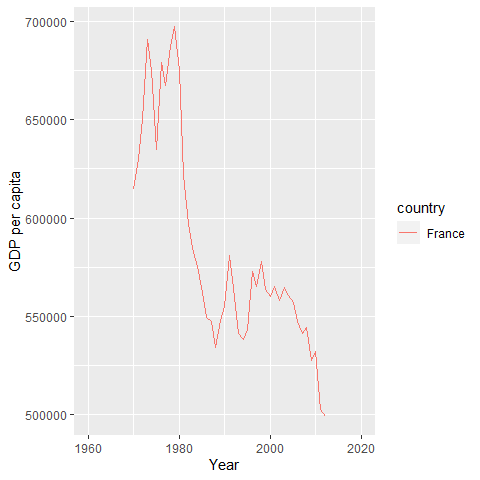

World Bank data exploration
================
Saif Shabou
17/02/2021

-   [Get data](#get-data)
-   [Total GHG emissions](#total-ghg-emissions)
    -   [Plot](#plot)
-   [References](#references)

In this notebook wi will explore ghg emissions data published from world
bank.

# Get data

Let’s identify datasets related to ghg emissions

``` r
library(WDI)
new_wdi_cache <- WDIcache()
datasets = WDIsearch("*emissions.", cache = new_wdi_cache)
print(head(datasets))
```

    ##      indicator       
    ## [1,] "EE.BOD.CGLS.ZS"
    ## [2,] "EE.BOD.CHEM.ZS"
    ## [3,] "EE.BOD.FOOD.ZS"
    ## [4,] "EE.BOD.MTAL.ZS"
    ## [5,] "EE.BOD.OTHR.ZS"
    ## [6,] "EE.BOD.PAPR.ZS"
    ##      name                                                                 
    ## [1,] "Water pollution, clay and glass industry (% of total BOD emissions)"
    ## [2,] "Water pollution, chemical industry (% of total BOD emissions)"      
    ## [3,] "Water pollution, food industry (% of total BOD emissions)"          
    ## [4,] "Water pollution, metal industry (% of total BOD emissions)"         
    ## [5,] "Water pollution, other industry (% of total BOD emissions)"         
    ## [6,] "Water pollution, paper and pulp industry (% of total BOD emissions)"

# Total GHG emissions

``` r
data = WDI(indicator=c("wb_total_ghg_emissions" = "EN.ATM.GHGT.KT.CE"))

print(head(datasets))
```

    ##      indicator       
    ## [1,] "EE.BOD.CGLS.ZS"
    ## [2,] "EE.BOD.CHEM.ZS"
    ## [3,] "EE.BOD.FOOD.ZS"
    ## [4,] "EE.BOD.MTAL.ZS"
    ## [5,] "EE.BOD.OTHR.ZS"
    ## [6,] "EE.BOD.PAPR.ZS"
    ##      name                                                                 
    ## [1,] "Water pollution, clay and glass industry (% of total BOD emissions)"
    ## [2,] "Water pollution, chemical industry (% of total BOD emissions)"      
    ## [3,] "Water pollution, food industry (% of total BOD emissions)"          
    ## [4,] "Water pollution, metal industry (% of total BOD emissions)"         
    ## [5,] "Water pollution, other industry (% of total BOD emissions)"         
    ## [6,] "Water pollution, paper and pulp industry (% of total BOD emissions)"

## Plot

``` r
library(dplyr)
```

    ## 
    ## Attaching package: 'dplyr'

    ## The following objects are masked from 'package:stats':
    ## 
    ##     filter, lag

    ## The following objects are masked from 'package:base':
    ## 
    ##     intersect, setdiff, setequal, union

``` r
emission_FR <- data %>% filter(iso2c == "FR")
emission_USA <- data %>% filter(iso2c == "US")

# non interactive plot
library(ggplot2)
ggplot(emission_FR, 
       aes(year, wb_total_ghg_emissions, color=country)) + 
  geom_line() + 
  xlab('Year') + 
  ylab('GDP per capita')
```

    ## Warning: Removed 18 row(s) containing missing values (geom_path).

<!-- -->

``` r
# interactive plot

# library(plotly)
# 
# fig <- plot_ly(emission_FR, x = ~year, y = ~wb_total_ghg_emissions,
#                type = 'scatter', mode = 'lines')
# 
# fig
```

# References

-   rendering
    [github\_document](https://rmarkdown.rstudio.com/github_document_format.html)
